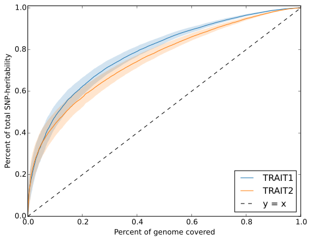

# Contrast polygenicity

We provide script (`misc/contrast_polygenicity.py`) to make the plot for
contrasting degrees of polygenicity between traits. The script can be
executed as follows.

## Input

* Local SNP-heritability estimates for a number of traits.

We recommend to plot less than 10 traits at a time.

## Example

The following is an example script to create the contrast polygenicity plot.

```
python $src/contrast_polygenicity.py \
    --local-hsqg-est <local SNP-heritability output trait 1>  <local SNP-heritability output trait 1> \
    --show-se --no-negative --trait-names TRAIT1 TRAIT2 \
    --out <output file name e.g. trait1_trait2_contrast.pdf>
```

Here `--no-negative` enforces any negative local estimates to 0.0
Standard error shade can be turned off by removing the `--show-se` flag.

The following is an example output figure.


