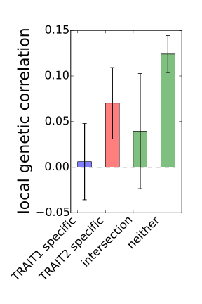

# Infer putative causality

This page describes script (`misc/infer_putative_causality.py`) for inferring
putative causality between a pair of traits.

## Input

* Local genetic covariance estimates for a pair of traits
* Local SNP-heritability estimates for both traits
* GWAS hits for both traits in the following format

```
CHR  BP
1    1124974
1    1146785
1    1146853
1    1151679
...  ...
22   50570755
22   50622404
22   50628937
22   50656109
```

## Example

The following script computes local genetic correlation at loci ascertained
for GWAS hits specific to trait 1 and trait 2.

```
python $src/infer_putative_causality.py \
    --local-rhog-est <local genetic covariance output> \
    --local-hsqg-est <local SNP-heritability output trait 1> <local SNP-heritability output trait 2> \
    --trait-names TRAIT1 TRAIT2 \
    --gwas-loci <trait 1 GWAS hits> <trait 2 GWAS hits> \
    --out <output file name e.g. trait1_trait2_causality.pdf> 
```

The following is an example output. In addition, a log file containing local
genetic correlation estimates will be created.

```
trait1  local_gcor1  local_gcor1_se  trait2  local_gcor2  local_gcor2_se
TRAIT1  0.006        0.021           TRAIT2  0.07         0.02
```


