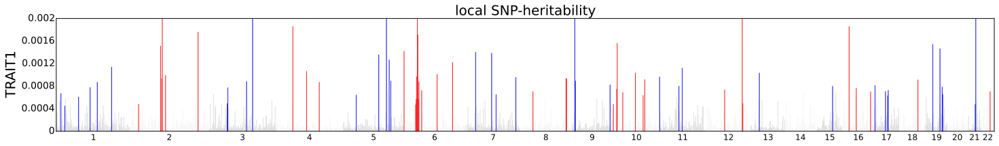
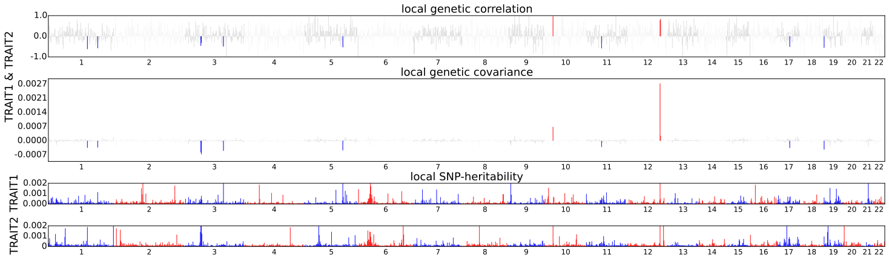

# Visualizing local estimates

This page describes script to visualize local SNP-heritability estimates
and local genetic covariance estimates.

## Local SNP-heritability estimates

We provide script (`misc/local_hsqg_manhattan.py`) that makes Manhattan-style
plot for visualizing local SNP-heritability estimates. The script can be
executed as follows.

```
python misc/local_hsqg_manhattan.py \
    --local-hsqg-est <local SNP-heritability output> \
    --out <output file name e.g. trait1_local_hsqg.pdf> \
    --trait-name TRAIT1
```

There following is an example figure generated by the visualization tool.
Here, colored bars represent loci that have significant local SNP-heritability.



## Local genetic covariance estimates

We provide script (`misc/local_rhog_manhattan.py`) that makes Manhattan-style
plot for visualizing local genetic covariance estimates. The script can be
executed as follows.

```
python misc/local_rhog_manhattan.py \
    --local-rhog-est <local genetic covariance estimates output> \
    --local-hsqg-est <local SNP-heritability output trait 1>  <local SNP-heritability output trait 2> \
    --out <output file name e.g. trait1_trait2_local_rhog.pdf> \
    --trait-names TRAIT1 TRAIT2
```

Similarly, colored bars represent loci that have significant local genetic covariance.


